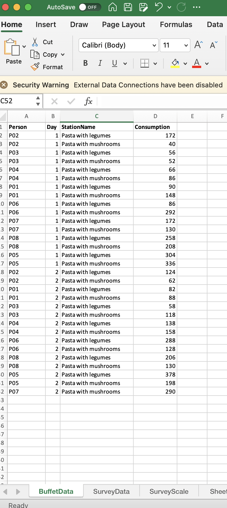
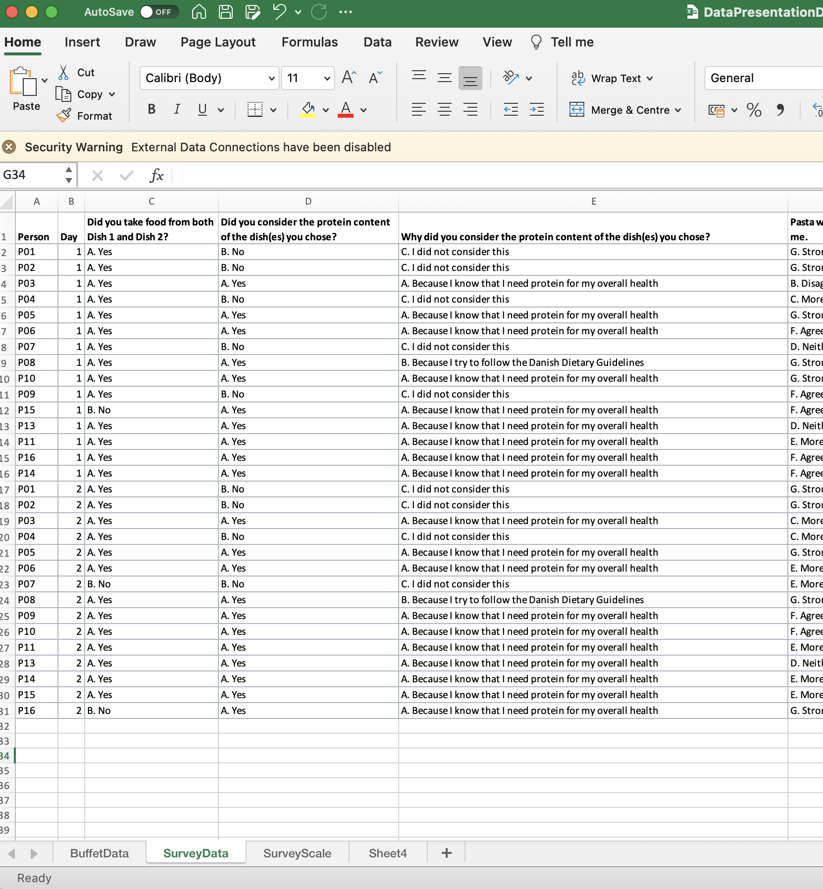
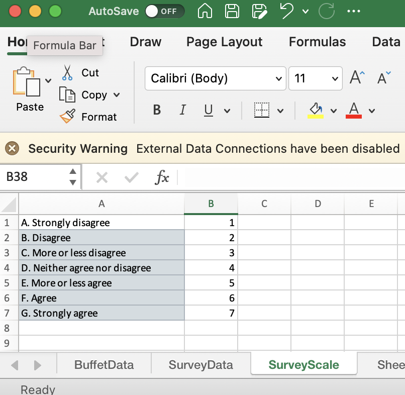

# Data

In this book several datasets are used targeting different research questions. 
However, a fair part of the analysis tools are common. That is, descriptive analysis, plots, response correlations etc. 

The data is included in the R-packgage you get by running the code below. 
Be aware that you need devtools package to install from github. 

```{r}
# install data-package
install.packages('devtools')
devtools::install_github('mortenarendt/data4consumerscience')
```

The data is also available as excel sheets, and can be loaded using packages capable of reading from excel. 
Below is an example using data from the so-called _iBuffet_ 

## Read in data from Excel - iBuffet

The data from the iBuffet comes in the form of csv or excel files. 

These can be in the form of 

* Consumption data from the Buffet 
* Survey data on liking, motivation, choices etc attaced to the particular buffet
* Survey data on demographics for the participants such as age, gender, eating habits etc. These are general and different from the former, in that they have nothing to do with the current buffet. 

{width=500px}

### Example of Survey data

{width=500px}

### Example of Survey Scale

{width=200px}

### Edit in excel

Turn the files into sheets in excel having all in one file. 

Setup the data in excel such that they match the above in terms of format. 

What is important is: 

* First row is used on headings and none of these are repeated. I.e. all unique within a sheet
* Data comes from row 2. 
* All rows should contain data (empty cell as also data), so all empty rows are removed
* Headings between sheets refering to the same: e.g. participant ID should have exactly similar heading. 
* If you have calculated stuff within excel such as a sum of the numbers in a coloum, then these should be removed from the sheet. It is not data!

We suggest that you keep both the original version of the data as a sheet, and the ready-to-import as a sheet. 

### Importing to R

Each of the sheets are imported seperately. Here we use the package readxl with the function read_excel. 
If the data is not in the same folder as your script, then include the path to the data, or move the data to the location. 
Be aware that the SurveyScale sheet does not have a heading. Here we import without (col_names = F), and set it manually afterwards, but you can also put it in manually.  

```{r}
library(readxl)
Buffet <- read_excel('./data/iBuffet.xlsx',sheet = 'BuffetData')
Survey <- read_excel('./data/iBuffet.xlsx',sheet = 'SurveyData')
Surveyscales <- read_excel('./data/iBuffet.xlsx',
                           sheet = 'SurveyScale', col_names =  F)
colnames(Surveyscales) <- c('answ','number')
```

Have a look at the imported elements to ensure that indeed, they mimic the excel-sheets. head(), str() and View() is your tools. 

```{r}
head(Buffet)
str(Buffet)
```

We see that the coloum with names (Person and StationName) is interpreted as characters (chr) while the stuff which should be numbers (Comsuption) is numeric (num). If that is not the case, you will need to transform them using as.numeric() or as.character(). 

### Editing in R

The Buffet data is optimal as is. We have the data as long format with all repsonse in _one_ coloumn and then coloums clearifying the design, time, type, person etc. 

However the Survey data is not optimal directly. 

Things to fix: 
* The 7-point for the last four questions we want en encode as a numerical factor correctly leveled. 
* The data can additionally be versioned in both long and wide format

```{r}
library(tidyverse)
Surveylong <- Survey %>% 
  gather(question,answ, `Pasta with legumes is visually appealing to me. `:
           `I like the taste of pasta with mushrooms! `) %>% 
  mutate(answ = answ %>% factor(levels = Surveyscales$answ), 
         answnum = answ %>% as.numeric())

Surveywide <- Surveylong %>% select(-answ) %>% spread(question,answnum)
```

### Merging the data

For the sake of being able to compare consumption (obtained from buffet data) with liking and motives (obtained from the survey data) these data frames needs to be merged. There are several merge options, here we use left_join() but full_join() and right_join() might more suited in some situations. 

#### Adding survey to buffets

Merging should be done such that Person and Day match. 
If you additionally have demographic data (gender, age, etc.) then obviously only Person should match, as the data is constant over Days. 

```{r}
Buffet_survey <- Buffet %>% 
  left_join(Surveywide, by = c('Person','Day'))
```

#### Adding buffet to survey

Similarly, merging should be done such that Person and Day match. 
If you additionally have demographic data (gender, age, etc.) then obviously only Person should match, as the data is constant over Days. 
Further, we use the long format of the survey data here.

```{r}
Surveylong_buffet <- Surveylong %>% 
  left_join(Buffet, by = c('Person','Day'))
```

Due to not having a total overlap of information, some responses (here for consumption) will be missing. That you can see using the table function. 

```{r}
table(is.na(Surveylong_buffet$Consumption))
```

### Save the data 

You can export any data frame from R to excel (for instance using the _rio_ package), as well as saving it as .RData for further analysis. 

Use save.image() to save everything, or use save() to specify which elements to save

```{r, eval=FALSE}
save.image(file = 'iBuffetSurveyDataEverything.RData') # everything
save(file = 'iBuffetSurveyData.RData',
     list = c('Survey','Surveylong_buffet',
              'Surveylong','Buffet_survey','Surveyscales')) # just the usesul and non-redundant stuff.
rio::export(Surveylong_buffet,file = 'Surveylong_buffet.xlsx') # export one data frame
```

### Ready for analysis 

Now you can simply load the data directly, and do not need to do the import-setup every time you want to do an analysis on the data. 

This part is not a part of the data import, but it is a good idea just to check that the data indeed is setup as expected. 

```{r, eval=FALSE}
load('iBuffetSurveyData.RData') 
```
